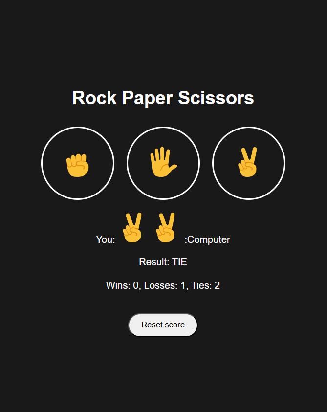

# Rock Paper Scissors 🎮

A simple and interactive **Rock-Paper-Scissors** game built with **HTML, CSS, and JavaScript**.  
This project demonstrates DOM manipulation, event handling, and game logic implementation.

---

## 🚀 Features

- Play against the computer
- Score tracking using `localStorage`
- Clean and responsive UI
- Emoji-based buttons for moves
- Reset score functionality

---

## 🛠️ Technologies Used

- HTML
- CSS
- JavaScript

---

## 📁 Project Structure
```
Rock-Paper-Scissors/
├── index.html
├── styles.css
├── script.js
└── images/
    ├── rock-emoji.png
    ├── paper-emoji.png
    └── scissors-emoji.png
```
---

## 📷 Preview



---

## 🌐 Live Demo

You can play the game live here:  
[Rock-Paper-Scissors Live](https://shainrima.github.io/rock-paper-scissors/)

---

## 💻 How to Run Locally

1. Clone the repository:

```bash
git clone https://github.com/shainrima/rock-paper-scissors.git
```
2. Open index.html in a web browser.
